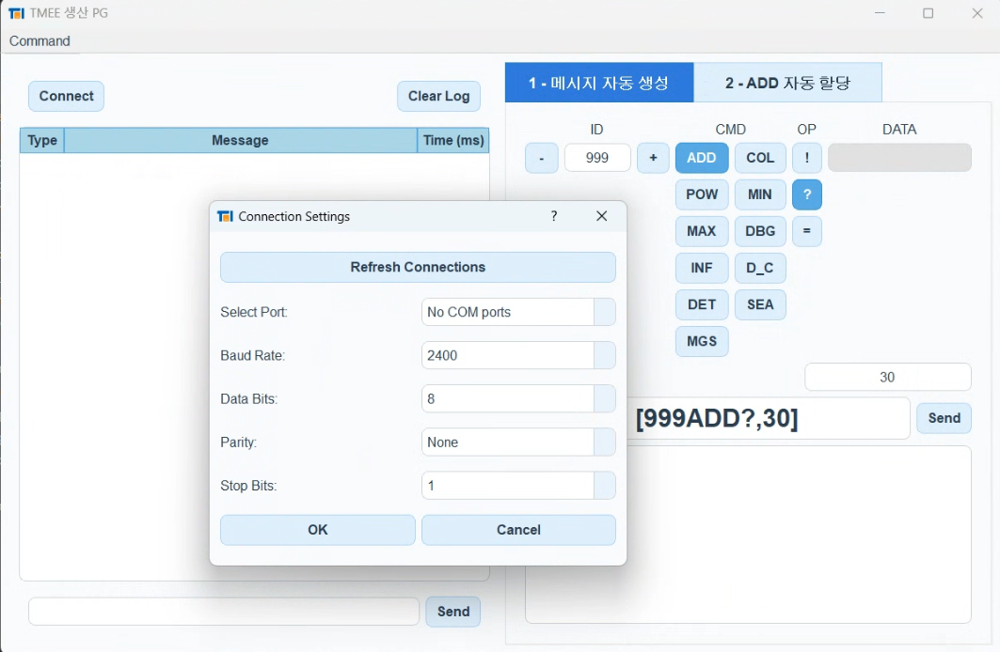

# Production Program (Demo)


---

## Overview

This repository demonstrates a Python-based production tool that configures and tests custom PCBs equipped with an embedded C program using a custom protocol. The PCBs are placed into a custom-ordered jig, and this Python application automates their setup and configuration via serial communication. It leverages PyQt5 for the graphical interface and the `pyserial` library for managing COM port connections. Python software and protocol design have been fully created by the author.

**Key Highlights**  
- **Automated Configuration**: Communicates with the embedded firmware on our custom PCB to set IDs, run checks, and more.  
- **PyQt5 GUI**: Simple, intuitive user-friendly interface
- **Custom PCB + Jig**: A C program is embedded into each PCB unit. The PCB can easily be connected to the jig, which is connected to the PC to manage the software program for communication
- **Serial Communication**: `pyserial` is used to send/receive data commands to the PCB.



> **Note**  
> This repository is mainly a **showcase** of the code structure and partial functionality, mainly aimed to showcase some of the coding done by the author at a previous internship. It is not set up as a fully packaged solution for external users. Permission has been granted to share this portion of the code as the author was responsible from start to end for the entire codebase uploaded here. Further heavy contributions were made towards PCB design and lower-level programming (C) for the project, which are not shared for security purposes.

---

## Dependencies

- **PyQt5**  
  - `pip install PyQt5`
  - Renders the GUI elements (buttons, text fields, logs).
- **pyserial**  
  - `pip install pyserial`
  - Facilitates communication over COM ports (USB-to-serial).

---

## File Descriptions

| **File**                          | **Description**                                                                                                                           |
|----------------------------------|-------------------------------------------------------------------------------------------------------------------------------------------|
| **main.py**                      | Launches the PyQt5 application, applies a custom style sheet, and displays the main window.                                               |
| **serial_port_monitor.py**       | Main window class that sets up the GUI layout (tabs, logs) and manages top-level user actions.                                            |
| **protocol_handler.py**          | Checks and formats messages (adds STX/ETX markers, calculates checksums) before send or after receive.                                    |
| **serial_reader_worker.py**      | Runs in a separate thread to continuously read incoming data from the serial port without blocking the GUI.                              |
| **communication_manager.py**     | Orchestrates the sending of messages and organizes the background thread to read data from the serial port.                              |
| **connection_manager.py**        | Handles opening/closing of serial port connections and calls up a dialog for serial settings if needed.                                  |
| **connection_settings_dialog.py**| A PyQt-based dialog to select COM ports, baud rate, parity, etc., then open the port for communication.                                  |
| **logger.py**                    | Provides a basic logging utility that inserts rows into the GUI’s log table (type, message, time).                                       |
| **ui_left_components.py**        | Defines the left-hand section of the main window (connect button, log table, manual command input).                                      |
| **ui_right_generator.py**        | UI for automatically generating commands (CMD, OP, ID, DATA fields). Allows partial customization of commands.                           |
| **ui_right_production.py**       | Automates the “address” assignment workflow (querying, setting, verifying) and logs success/failure states.                              |
| **ui_menu.py**                   | Menu bar functionality for adding, editing, or removing custom commands.                                                                  |
| **style.qss**                    | A style sheet for customizing the look and feel of the PyQt widgets (colors, fonts, spacing).                                            |

---

## Usage (Simplified Demo)

1. **Insert PCB**  
   Connect Jig ports using cables for serial connection with PC. Place target PCB to configure into the jig.
2. **Run the App** - For those who simply want to view the app, simply run the following code after having installed the dependencies
   ```bash
   python main.py
   ```
   The PyQt GUI will appear, displaying a log panel, connect button, and tabs.
   
   The entire program has been exported into a .exe file separately for ease of use at the company.
4. **Basic Interaction**
   - Select the correct COM port with the Connect button, using settings (such as baud rate, parity bit) of your choice
   - Adjust the address, send/receive messages, or reset the PCB with a few clicks.
   - Automation process is on tab 2, easily configuring our custom made PCBs for the initial setup
   - Commands maybe added/deleted/edited as necessary, on top of the basic commands used
